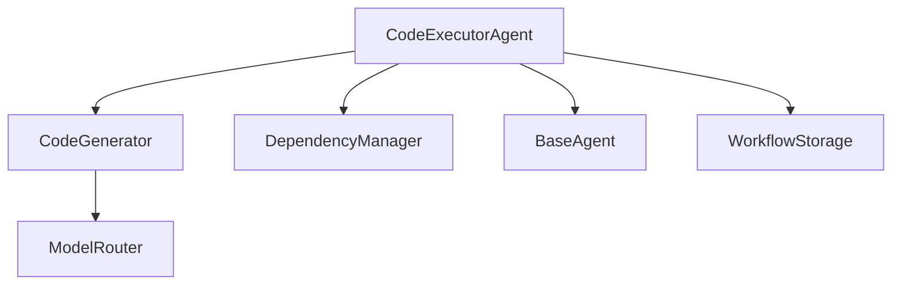

# 📘 دليل Code Executor Agent - Phase 3.2

**الإصدار:** 1.0  
**تاريخ الإنشاء:** 15 نوفمبر 2025  
**الحالة:** ✅ مكتمل  
**المرحلة:** Phase 3.2 - Code Executor Agent Development

---

## 📋 نظرة عامة

**Code Executor Agent** هو الوكيل المسؤول عن توليد الأكواد، إنشاء هياكل المشاريع، إدارة الاعتماديات، وإصلاح الأخطاء في المنصة. يتكامل بسلاسة مع **Planner Agent** لتنفيذ المهام البرمجية.

### المسؤوليات الرئيسية

1. **توليد الأكواد:** استخدام AI لتوليد أكواد عالية الجودة بلغات متعددة
2. **إنشاء المشاريع:** إنشاء هياكل الملفات والمجلدات للمشاريع
3. **إدارة الاعتماديات:** تثبيت وإدارة packages (pip, npm, etc.)
4. **إصلاح الأخطاء:** إصلاح الأكواد تلقائياً باستخدام AI
5. **تنفيذ الأكواد:** تشغيل Python/Bash scripts

### الميزات الجديدة (Phase 3.2)

- ✅ **توليد أكواد ذكي:** AI-powered code generation لـ 8 لغات
- ✅ **معالجة التعارضات:** Conflict handling مع backup تلقائي
- ✅ **Rollback آلي:** التراجع التلقائي عند حدوث أخطاء
- ✅ **Package installation:** تثبيت حقيقي للـ dependencies
- ✅ **Input validation:** التحقق من صحة المدخلات
- ✅ **Error recovery:** إصلاح تلقائي للأخطاء مع retry logic

---

## 🏗️ البنية المعمارية

### الملفات الرئيسية

```
dev_platform/
├── agents/
│   ├── code_executor_agent.py     # الوكيل الرئيسي (793 lines)
│   └── schemas.py                 # Schemas (CodeArtifact, DependencyConfig, etc.)
├── tools/
│   ├── code_generator.py          # توليد الأكواد (115 lines, 89% coverage)
│   └── dependency_manager.py      # إدارة الاعتماديات (112 lines, 91% coverage)
└── tests/
    ├── unit/test_code_generator.py
    ├── unit/test_dependency_manager.py
    ├── unit/test_code_executor_async.py
    └── integration/test_code_executor_integration.py
```

### المكونات الأساسية



---

## 📊 Schemas الأساسية

### 1. CodeArtifact

```python
class CodeArtifact(BaseModel):
    """مخرجات توليد الكود"""
    language: CodeLanguage         # اللغة البرمجية
    file_path: str                 # مسار الملف (نسبي)
    content: str                   # محتوى الكود
    description: Optional[str]     # وصف الكود
    dependencies: List[str]        # الاعتماديات المطلوبة
    task_id: Optional[int]         # رقم المهمة
    is_entry_point: bool           # هل هو entry point؟
```

**اللغات المدعومة:**
- Python, JavaScript, TypeScript
- HTML, CSS
- JSON, YAML, Markdown

### 2. DependencyConfig

```python
class DependencyConfig(BaseModel):
    """إعدادات الاعتماديات"""
    language: str                  # python, node, etc.
    packages: List[str]            # القوائم الرئيسية
    dev_packages: List[str]        # قوائم التطوير
    config_file: str               # requirements.txt, package.json
    install_command: str           # pip install -r, npm install
```

### 3. CodeGenerationRequest

```python
class CodeGenerationRequest(BaseModel):
    """طلب توليد كود"""
    task: Task                     # المهمة المراد تنفيذها
    project_context: Dict          # سياق المشروع
    template_name: Optional[str]   # Template اختياري
    target_directory: str          # المجلد الهدف
```

### 4. CodeGenerationResult

```python
class CodeGenerationResult(BaseModel):
    """نتيجة توليد الكود"""
    success: bool
    artifacts: List[CodeArtifact]  # الأكواد المولدة
    dependencies: Optional[DependencyConfig]
    errors: List[str]
    warnings: List[str]
    files_created: List[str]
    execution_time_seconds: float
```

### 5. ExecutionError

```python
class ExecutionError(BaseModel):
    """خطأ في التنفيذ"""
    error_type: str                # syntax, runtime, import, etc.
    message: str
    line_number: Optional[int]
    column_number: Optional[int]
    file_path: Optional[str]
    severity: ErrorSeverity        # INFO, WARNING, ERROR, CRITICAL
    stack_trace: Optional[str]
    suggested_fix: Optional[str]
    timestamp: str
```

---

## 🔧 Async API Methods

### 1. generate_code()

```python
async def generate_code(
    self,
    request: CodeGenerationRequest
) -> CodeGenerationResult
```

**الوصف:** توليد كود باستخدام AI بناءً على مهمة معينة

**Parameters:**
- `request`: CodeGenerationRequest مع Task وcontext

**Returns:** CodeGenerationResult مع artifacts والاعتماديات

**مثال:**

```python
from dev_platform.agents.schemas import Task, CodeGenerationRequest

# إنشاء مهمة
task = Task(
    id=1,
    title="Create Flask API endpoint",
    description="Create a RESTful API endpoint for user registration",
    status="pending"
)

# إنشاء طلب
request = CodeGenerationRequest(
    task=task,
    project_context={
        "project_name": "my_api",
        "project_type": "api",
        "technologies": ["python", "flask"]
    }
)

# توليد الكود
result = await code_executor.generate_code(request)

if result.success:
    print(f"✓ Generated {len(result.artifacts)} files")
    for artifact in result.artifacts:
        print(f"  - {artifact.file_path}: {len(artifact.content)} chars")
else:
    print(f"✗ Errors: {result.errors}")
```

**الميزات:**
- ✅ Validation للمدخلات (يجب أن يكون للمهمة title أو description)
- ✅ تحويل تلقائي لـ language إلى CodeLanguage enum
- ✅ استخراج الاعتماديات تلقائياً
- ✅ Error handling شامل

---

### 2. create_file_structure()

```python
async def create_file_structure(
    self,
    structure: ProjectStructure,
    base_path: str = ".",
    overwrite: bool = False,
    backup: bool = True
) -> Dict
```

**الوصف:** إنشاء هيكل ملفات المشروع مع معالجة التعارضات

**Parameters:**
- `structure`: ProjectStructure مع الملفات والمجلدات
- `base_path`: المسار الأساسي (افتراضي: ".")
- `overwrite`: السماح بالكتابة فوق الملفات الموجودة
- `backup`: إنشاء نسخ احتياطية قبل الكتابة فوق الملفات

**Returns:**
```python
{
    "success": True,
    "files_created": ["src/main.py", "src/utils.py"],
    "folders_created": ["src", "tests"],
    "total_items": 4,
    "conflicts": ["src/main.py"],  # ملفات موجودة مسبقاً
    "backups": ["src/main.py.backup_20251115_143022"],
    "conflicts_count": 1
}
```

**مثال:**

```python
from dev_platform.agents.schemas import ProjectStructure

# إنشاء هيكل مشروع
structure = ProjectStructure(
    folders=["src", "tests", "docs"],
    files=[
        {
            "path": "src/main.py",
            "content": "def main():\n    print('Hello!')"
        },
        {
            "path": "tests/test_main.py",
            "content": "import unittest\n..."
        },
        {
            "path": "README.md",
            "content": "# My Project\n\nDescription..."
        }
    ]
)

# إنشاء الهيكل
result = await code_executor.create_file_structure(
    structure=structure,
    base_path="./my_project",
    overwrite=True,
    backup=True
)

print(f"✓ Created {result['total_items']} items")
if result['conflicts']:
    print(f"⚠ {len(result['conflicts'])} conflicts (backed up)")
```

**الميزات:**
- ✅ **Conflict detection:** كشف الملفات الموجودة
- ✅ **Backup تلقائي:** نسخ احتياطي قبل الكتابة فوق
- ✅ **Rollback آلي:** التراجع التلقائي عند حدوث أخطاء
- ✅ **دعم Dict و String:** مرونة في تعريف الملفات

---

### 3. install_dependencies()

```python
async def install_dependencies(
    self,
    dependencies: DependencyConfig,
    base_path: str = ".",
    auto_install: bool = False
) -> Dict
```

**الوصف:** تثبيت الاعتماديات وإنشاء ملفات الإعدادات

**Parameters:**
- `dependencies`: DependencyConfig مع القوائم والأوامر
- `base_path`: المسار الأساسي
- `auto_install`: تثبيت تلقائي للحزم (pip/npm)

**Returns:**
```python
{
    "success": True,
    "config_file": "./requirements.txt",
    "packages_count": 3,
    "install_command": "pip install -r requirements.txt",
    "installed": True,
    "install_output": "Successfully installed...",
    "message": "Dependencies installed and configured in requirements.txt"
}
```

**مثال:**

```python
from dev_platform.agents.schemas import DependencyConfig

# إعداد الاعتماديات
deps = DependencyConfig(
    language="python",
    packages=["flask", "requests", "pydantic"],
    dev_packages=["pytest", "black"],
    config_file="requirements.txt",
    install_command="pip install -r requirements.txt"
)

# تثبيت الاعتماديات
result = await code_executor.install_dependencies(
    dependencies=deps,
    base_path="./my_project",
    auto_install=True  # تثبيت فعلي
)

if result['success'] and result['installed']:
    print(f"✓ Installed {result['packages_count']} packages")
    print(result['install_output'])
```

**الميزات:**
- ✅ **Real installation:** تثبيت حقيقي للحزم (asyncio subprocess)
- ✅ **Error handling:** معالجة أخطاء التثبيت
- ✅ **Output capture:** التقاط مخرجات التثبيت
- ✅ **Flexible install:** اختياري (config فقط أو config + install)

---

### 4. apply_code_fixes()

```python
async def apply_code_fixes(
    self,
    fix_request: CodeFixRequest
) -> CodeFixResult
```

**الوصف:** إصلاح الأكواد تلقائياً باستخدام AI

**Parameters:**
- `fix_request`: CodeFixRequest مع الكود والأخطاء

**Returns:**
```python
CodeFixResult(
    success=True,
    fixed_artifact=CodeArtifact(...),
    errors_fixed=[...],
    errors_remaining=[],
    fix_description="Fixed 3 errors in 2 attempts",
    attempts_used=2
)
```

**مثال:**

```python
from dev_platform.agents.schemas import (
    CodeFixRequest, ExecutionError, ErrorSeverity
)

# تحديد الأخطاء
errors = [
    ExecutionError(
        error_type="syntax",
        message="invalid syntax",
        line_number=5,
        severity=ErrorSeverity.ERROR
    ),
    ExecutionError(
        error_type="import",
        message="ModuleNotFoundError: No module named 'flask'",
        line_number=1,
        severity=ErrorSeverity.ERROR
    )
]

# طلب الإصلاح
fix_request = CodeFixRequest(
    artifact=original_artifact,
    errors=errors,
    max_attempts=3
)

# إصلاح الأخطاء
result = await code_executor.apply_code_fixes(fix_request)

if result.success:
    print(f"✓ Fixed {len(result.errors_fixed)} errors")
    print(result.fix_description)
    
    # استخدام الكود المصحح
    fixed_code = result.fixed_artifact.content
else:
    print(f"✗ {len(result.errors_remaining)} errors remaining")
```

**الميزات:**
- ✅ **Retry logic:** محاولات متعددة للإصلاح
- ✅ **AI-powered:** استخدام model لفهم الأخطاء وإصلاحها
- ✅ **Error tracking:** تتبع الأخطاء المصلحة والباقية
- ✅ **Attempts tracking:** عدد المحاولات المستخدمة

---

## 🔄 التكامل مع Planner Agent

### سير العمل الكامل

```python
# 1. Planner يحلل الطلب
planner = PlannerAgent()
project_plan = await planner.analyze_user_request(
    "Create a Flask API with user authentication"
)

# 2. CodeExecutor ينفذ المهام
code_executor = CodeExecutorAgent()

for task in project_plan['tasks']:
    # توليد الكود
    request = CodeGenerationRequest(
        task=task,
        project_context=project_plan
    )
    
    result = await code_executor.generate_code(request)
    
    if result.success:
        # كتابة الملفات
        for artifact in result.artifacts:
            file_path = Path(artifact.file_path)
            file_path.write_text(artifact.content)
        
        # تثبيت الاعتماديات
        if result.dependencies:
            await code_executor.install_dependencies(
                result.dependencies,
                auto_install=True
            )

# 3. QA Agent يختبر الكود (Phase 3.3)
```

---

## 🧪 الاختبارات

### تشغيل الاختبارات

```bash
# جميع الاختبارات
cd tests
python -m pytest unit/test_code_generator.py unit/test_dependency_manager.py -v

# اختبار محدد
python -m pytest unit/test_code_generator.py::TestCodeGenerator::test_generate_code_python -v

# مع التغطية
python -m pytest --cov=dev_platform.tools.code_generator --cov-report=html
```

### الإحصائيات

- **Unit Tests:** 37 passed
- **Coverage:**
  - code_generator.py: 89%
  - dependency_manager.py: 91%
- **LSP Errors:** 0
- **Code Lines:** 793 (CodeExecutorAgent)

---

## ⚙️ Best Practices

### 1. التحقق من المدخلات

```python
# دائماً تحقق من المدخلات
if not task.title and not task.description:
    raise ValueError("Task must have title or description")
```

### 2. معالجة الأخطاء

```python
try:
    result = await code_executor.generate_code(request)
except Exception as e:
    logger.error(f"Code generation failed: {e}")
    # Fallback أو retry
```

### 3. استخدام Backup

```python
# دائماً استخدم backup عند الكتابة فوق ملفات
await code_executor.create_file_structure(
    structure=structure,
    overwrite=True,
    backup=True  # ✓ مهم!
)
```

### 4. التثبيت التدريجي

```python
# ابدأ بالـ config، ثم ثبّت عند الحاجة
await code_executor.install_dependencies(
    dependencies=deps,
    auto_install=False  # config فقط
)

# بعد التأكد، ثبّت
await code_executor.install_dependencies(
    dependencies=deps,
    auto_install=True  # تثبيت فعلي
)
```

---

## 🚨 الأخطاء الشائعة

### 1. عدم التحقق من success

```python
# ✗ خطأ
result = await code_executor.generate_code(request)
print(result.artifacts[0].content)  # قد يفشل!

# ✓ صحيح
result = await code_executor.generate_code(request)
if result.success:
    for artifact in result.artifacts:
        print(artifact.content)
else:
    print(f"Errors: {result.errors}")
```

### 2. تجاهل Conflicts

```python
# ✗ خطأ
result = await code_executor.create_file_structure(structure)
# يتخطى الملفات الموجودة بدون تحذير

# ✓ صحيح
result = await code_executor.create_file_structure(
    structure,
    overwrite=True,
    backup=True
)
if result['conflicts_count'] > 0:
    print(f"⚠ Overwritten {result['conflicts_count']} files")
```

### 3. عدم استخدام Rollback

```python
# ✓ Rollback تلقائي عند الأخطاء
# لا داعي للقلق - النظام يتراجع تلقائياً
```

---

## 📈 الأداء والتحسينات

### Metrics

| Metric | Value |
|--------|-------|
| Code Generation Time | ~2-5s per file |
| File Creation Time | <1s for 10 files |
| Package Installation | Depends on packages |
| Error Fix Time | ~3-8s (with retries) |

### التحسينات المستقبلية

1. **Caching:** تخزين الأكواد المولدة المشابهة
2. **Parallel generation:** توليد ملفات متعددة بالتوازي
3. **Template optimization:** templates محسّنة للسرعة
4. **Diff-based fixes:** إصلاحات أسرع بناءً على diffs

---

## 🔗 الموارد الإضافية

- [PHASE_3_ROADMAP.md](../PHASE_3_ROADMAP.md) - خارطة الطريق الكاملة
- [PLANNER_AGENT_GUIDE.md](./PLANNER_AGENT_GUIDE.md) - دليل Planner Agent
- [schemas.py](../dev_platform/agents/schemas.py) - جميع Schemas
- [Tests](../tests/unit/) - اختبارات شاملة

---

## 📝 الملخص

**Code Executor Agent** هو محرك توليد الأكواد في المنصة. يتكامل مع Planner لتنفيذ المهام البرمجية بكفاءة وجودة عالية.

**الإنجازات (Phase 3.2):**
- ✅ 4 Async methods جديدة
- ✅ Validation شامل
- ✅ Conflict handling + Rollback
- ✅ Package installation حقيقي
- ✅ 37 اختبار ناجح
- ✅ 0 LSP errors
- ✅ 89-91% code coverage

**الخطوة التالية:** Phase 3.3 - QA/Test Agent Development

---

**الإصدار:** 1.0  
**آخر تحديث:** 15 نوفمبر 2025
